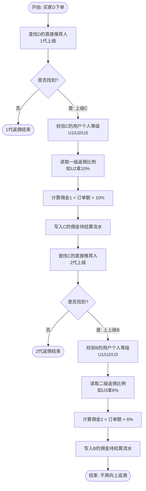
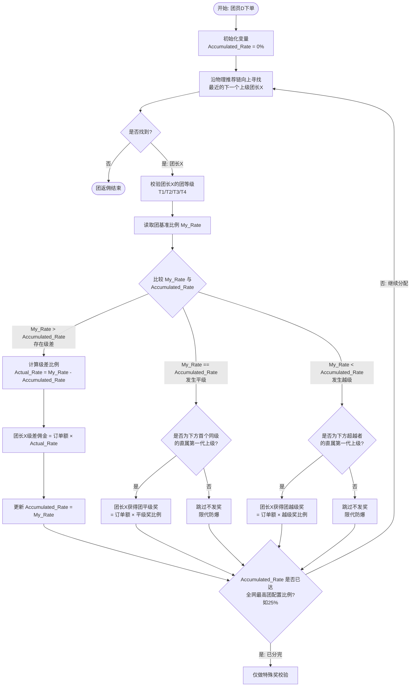

# 商城系统【双轨成长与分润】核心需求设计方案

> **方案说明**：本方案专为"全员皆团长"但"个人身份"与"军团规模"双轨解耦的社交电商系统定制。系统明确区分**用户个人等级（尊享权益、代际直推）**与**团等级（军团规模、无限代级差）**。两套体系考核独立、权益叠加，通过分布式事件驱动（MQ）实现并行分润结算，并配合平级/越级机制解决团队利益断流问题。

---

## 1. 业务概述与全员双轨架构

### 1.1 全员双轨核心逻辑

- **注册即建团**：用户完成注册即拥有专属邀请码。他既是一个**独立消费者/分享者**（拥有个人等级），也同时拥有了一支**初始军团**（拥有团等级）。
- **团员归属定义**：用户 A 邀请 B，B 邀请 C。在物理关系上形成 `A → B → C` 的树状链。B 和 C 永远是 A 的军团成员。
- **双轨权益分离**：
  - **用户等级**：主要考核**个人能力**（自购金额、直推零售额）。升级后提高自购省钱比例和**第一代/第二代直推佣金**。
  - **团等级**：主要考核**军团规模**（团队总业绩、团队内高等级团数）。升级后提高**无限代团队极差分润比例**。

### 1.2 核心流程总览（双轨并行机制）

当用户完成订单支付或确认收货（触发结算时点）时，系统将订单信息拆分并**同时推送到两个完全独立的结算中心**。双方在计算过程中**互不干扰、权益叠加**。最终将计算出的各笔佣金合并写入账户。

```
[订单结算事件触发]
    │
    ├──> 【用户返佣引擎中心】 ──> 仅追溯前2代推荐人 ──> 依"用户等级"计固定比例
    │
    └──> 【团返佣引擎中心】   ──> 无限代向上溯源     ──> 依"团等级"计极差、平级、越级奖
```

---

## 2. 动态成长体系（个人等级 vs 团队等级）

### 2.1 用户个人等级模型（考核个人零售）

> 主要面向个人代销、自购省钱或单纯的小范围分享者，不看团队无限代业绩。

| 等级 | 名称 | 升级条件 | 核心权益 |
|------|------|----------|----------|
| U1 | 体验会员 | 注册即送 | 基础自购省钱 |
| U2 | VIP会员 | 个人累计自购/零售满 500 元 | 直推佣金加成 |
| U3 | 服务商 | 直推 U2 会员满 5人，且个人当月零售满 3000 元 | 更高直推佣金比例 |

### 2.2 团等级模型（考核军团规模与级差）

> 主要面向团队领导人，考核无限代军团的裂变深度与整体销售额。

| 等级 | 名称 | 升级条件 | 核心权益 |
|------|------|----------|----------|
| T1 | 新星车队 | 默认自带 | 无限代团队极差拨比最低 |
| T2 | 铁甲军团 | 团队（无限代）累计总业绩达 10,000 元 | 提升极差分润比例 |
| T3 | 荣耀王牌 | 团队累计总业绩达 80,000 元，且旗下不同线产生至少 2 个 T2 军团 | 更高极差 + 平级奖 |
| T4 | 巅峰元帅 | 团队累计总业绩达 500,000 元，且旗下不同线产生至少 2 个 T3 荣耀王牌 | 最高极差 + 平级/越级奖 |

---

## 3. 【用户返佣流程与逻辑】详细设计

用户返佣基于**绝对物理代际关系**（只看直接推荐和间接推荐两层），佣金比例由上级当时的"用户个人等级"（U1/U2/U3）决定。

### 3.1 用户返佣业务流程图



### 3.2 核心计算逻辑与边界

- **截断规则**：无论买家上方有多少级用户，用户等级返佣**最多且只寻找2代**。第3代及以上上级在"用户返佣引擎"中分润为 0。
- **身份即时性**：计算佣金时，必须实时查询上级当时所处的 `user_level`。
- **计算公式**：
  - 1代（直接推荐人）佣金 = `订单计算基数 × 1代_Rate(当前上级用户等级)`
  - 2代（间接推荐人）佣金 = `订单计算基数 × 2代_Rate(当前上上级用户等级)`

---

## 4. 【团返佣流程与逻辑】详细设计

团返佣基于**无限代团队级差架构**。当团员下单，系统会沿着推荐链无限向上溯源，直到把配置的最高团奖比例（例如 T4 的 25%）全部分完，或者链条到头为止。在追溯过程中，通过比对直属上下级的"团等级"（T1/T2/T3/T4）判定极差、平级或越级。

### 4.1 团返佣核心业务流程图



### 4.2 核心计算逻辑与边界

#### 级差递扣逻辑

钱从下往上发，每次被中间的团长拦截一部分。

**公式**：`团长所得 = 订单额 × (自身团比例 - 旗下已分出的累计团比例)`

#### 团平级判定边界（限代 1 代）

**场景**：`D → C(T3) → B(T3) → A(T3)`

1. D 下单，C 拿满极差 18%，`Accumulated_Rate` 变为 18%
2. 向上遇到 B(T3)，级差为 0%
3. 由于 B 是 C 的**直接第一代上级**，B 获得 **T3平级奖**
4. 再向上遇到 A(T3)，A 属于第二代平级，**A 的级差和平级奖同时归 0**，直接跳过

#### 团越级判定边界（伯乐保护期）

**场景**：`D → C(T4) → B(T3)`

1. D 下单，C(T4) 拦截 25% 极差
2. 向上追溯到 B(T3)，B 自身比例 18% 小于 25%，级差为负
3. 系统校验 B 是 C（超越者）的**直接直属第一代推荐人**
4. B 触发并获得 **T3越级奖**
5. 若 B 上方还有 A(T2)，A 属于多代越级，不享受任何越级奖

---

## 5. 后台功能模块设计（全景规则面板）

### 5.1 用户个人等级与基础代际返佣表

| 用户等级 (User Level) | 直推(一级)返佣比例 | 间推(二级)返佣比例 | 升级考核条件 |
|----------------------|-------------------|-------------------|-------------|
| **U1 体验会员** | 5% | 2% | 注册成功（默认） |
| **U2 VIP会员** | 10% | 4% | 个人累计消费满 500 元 |
| **U3 服务商** | 15% | 6% | 直推5个U2 + 个人当月零售 3000 元 |

### 5.2 团等级与军团极差/平越级一体化配置表

| 团等级 (Team Level) | 军团极差分润比例 | 团平级奖励比例 | 团越级奖励比例 | 团升级考核条件 |
|--------------------|-----------------|---------------|---------------|---------------|
| **T1 新星车队** | 3% | 不启用 | 不启用 | 默认自带 |
| **T2 铁甲军团** | 10% | 1.0%（同级T2） | 0.5%（被下级超） | 团总业绩满 10,000 元 |
| **T3 荣耀王牌** | 18% | 1.5%（同级T3） | 1.0%（被下级超） | 团总业绩8万 + 2个T2线 |
| **T4 巅峰元帅** | 25% | 2.0%（同级T4） | 1.5%（被下级超） | 团总业绩50万 + 2个T3线 |

> **全局防爆控制安全阀**：系统设硬性阈值：`【U3直推最高 15%】 + 【T4最高极差 25%】 + 【团特殊奖最高 2%】 = 最大总拨比 42%`。后台若配置超标则强制拦截。

---

## 6. 数据库核心表结构设计

### 6.1 用户双轨身份与推荐树表 (`user_dual_profile`)

| 字段名 | 类型 | 注释 |
|--------|------|------|
| `uid` | bigint | 用户UID (主键) |
| `invite_code` | varchar | 自身邀请码 (唯一索引) |
| `parent_uid` | bigint | 直接推荐人UID (索引) |
| `relation_path` | varchar | 无限代物理树全路径，形如 `,1,18,102,` (用于跑批计团业绩) |
| `user_level` | tinyint | 用户个人等级 (1-U1, 2-U2, 3-U3) |
| `team_level` | tinyint | 团等级 (1-T1, 2-T2, 3-T3, 4-T4) |
| `create_time` | datetime | 注册时间 |

### 6.2 综合分润流水明细表 (`mall_commission_ledger`)

| 字段名 | 类型 | 注释 |
|--------|------|------|
| `log_id` | bigint | 自增主键 |
| `order_sn` | varchar | 订单号 (索引) |
| `buyer_uid` | bigint | 购买者UID |
| `benefit_uid` | bigint | 获佣收益人UID (索引) |
| `engine_type` | tinyint | 1-用户代际返佣, 2-团级差分润, 3-团平级奖, 4-团越级奖 |
| `order_amount` | decimal | 订单计算基数金额 |
| `current_identity` | varchar | 记录获佣人当时的双轨状态（如：U2 + T3） |
| `distributed_rate` | decimal | （仅在团极差时使用）本轮计算前已被下级团长分走的累计比例 |
| `settle_rate` | decimal | 本次计算最终采用的单项百分比 |
| `commission` | decimal | 最终发放的佣金金额 |
| `status` | tinyint | 0-冻结中, 1-已结算, 2-已失效(退款) |

---

## 7. 双轨返佣数据结构流转示例

### 7.1 场景基础

- **买家**：D 下单，实付 **1000 元**
- **物理推荐线**：`D → C (U1, T1:3%) → B (U3, T3:18%) → A (U2, T3:18%)`

### 7.2 用户返佣引擎流水生成结果

用户引擎启动，仅检索 2 代，生成 2 行流水：

| 序号 | 获佣人 | 代际关系 | 用户等级 | 返佣比例 | 佣金金额 | 计算说明 |
|------|--------|---------|---------|---------|---------|---------|
| 1 | C | 1代上级 | U1 | 5% | 50 元 | `1000 × 5% = 50` |
| 2 | B | 2代上级 | U3 | 6% | 60 元 | `1000 × 6% = 60` |

**用户返佣合计**：110 元

### 7.3 团返佣引擎流水生成结果

团引擎启动，无限代向上递归，累计扣减更新：

| 序号 | 获佣人 | 团等级 | 团比例 | 已分配比例 | 实际比例 | 佣金类型 | 佣金金额 | 计算说明 |
|------|--------|--------|--------|-----------|---------|---------|---------|---------|
| 1 | C | T1 | 3% | 0% | 3% | 级差奖 | 30 元 | `(3% - 0%) × 1000 = 30` |
| 2 | B | T3 | 18% | 3% | 15% | 级差奖 | 150 元 | `(18% - 3%) × 1000 = 150` |
| 3 | A | T3 | 18% | 18% | 0% | 平级奖 | 15 元 | `1.5% × 1000 = 15` |

**关键节点说明**：
- C 处理后：`Accumulated_Rate` 刷新为 **3%**
- B 处理后：`Accumulated_Rate` 刷新为 **18%**
- A 处理时：级差为 0%，触发平级检验。A 是 B 的直属第一代上级，获得 T3 平级奖（1.5%）

**团返佣合计**：195 元

### 7.4 最终分润汇总

| 获佣人 | 用户返佣 | 团返佣 | 合计佣金 |
|--------|---------|--------|---------|
| C | 50 元 | 30 元 | **80 元** |
| B | 60 元 | 150 元 | **210 元** |
| A | 0 元 | 15 元 | **15 元** |
| **总计** | **110 元** | **195 元** | **305 元** |

> **总拨比**：`305 / 1000 = 30.5%`，未超过全局安全阀 42%

---

## 8. 技术实现要点

### 8.1 分布式事件驱动架构

```
订单支付/确认收货
    ↓
发布 OrderSettledEvent (MQ)
    ↓
┌──────────────┬──────────────┐
│              │              │
用户返佣消费者   团返佣消费者    ...其他消费者
    ↓              ↓
计算1/2代佣金    计算无限代级差
    ↓              ↓
写入佣金流水     写入佣金流水
    ↓              ↓
异步合并入账     异步合并入账
```

### 8.2 关键性能优化

1. **推荐链缓存**：使用 Redis 缓存用户的完整推荐路径，避免频繁查询数据库
2. **批量结算**：采用定时任务批量处理待结算佣金，减少数据库压力
3. **幂等性保证**：所有佣金计算接口支持幂等，防止 MQ 重复消费导致重复发放
4. **事务隔离**：用户返佣和团返佣分别独立事务，互不影响

### 8.3 异常处理机制

- **退款逆向流程**：订单退款时，根据 `mall_commission_ledger` 中的 `order_sn` 反向冲销所有相关佣金
- **等级变更回溯**：佣金计算以订单结算时刻的等级为准，后续等级变更不影响历史订单
- **数据一致性校验**：定期对账，确保佣金流水总额与账户余额一致

---

## 附录

### A. 术语对照表

| 术语 | 说明 |
|------|------|
| 代际 | 推荐关系的层级，1代为直接推荐，2代为间接推荐 |
| 极差 | 上级团比例减去下级已分配比例的差值 |
| 平级奖 | 上下级团等级相同时，给予直属上级的额外奖励 |
| 越级奖 | 下级团等级超越上级时，给予直属上级的伯乐奖励 |
| Accumulated_Rate | 已累计分配的团比例，用于级差计算 |

### B. 版本记录

| 版本 | 日期 | 修改内容 | 作者 |
|------|------|---------|------|
| v1.0 | 2026-06-06 | 初始版本，完成双轨分润方案设计 | - |
